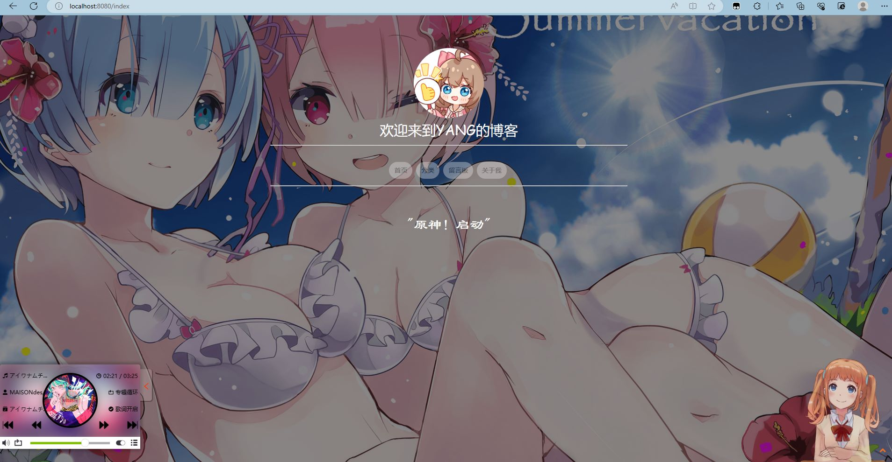
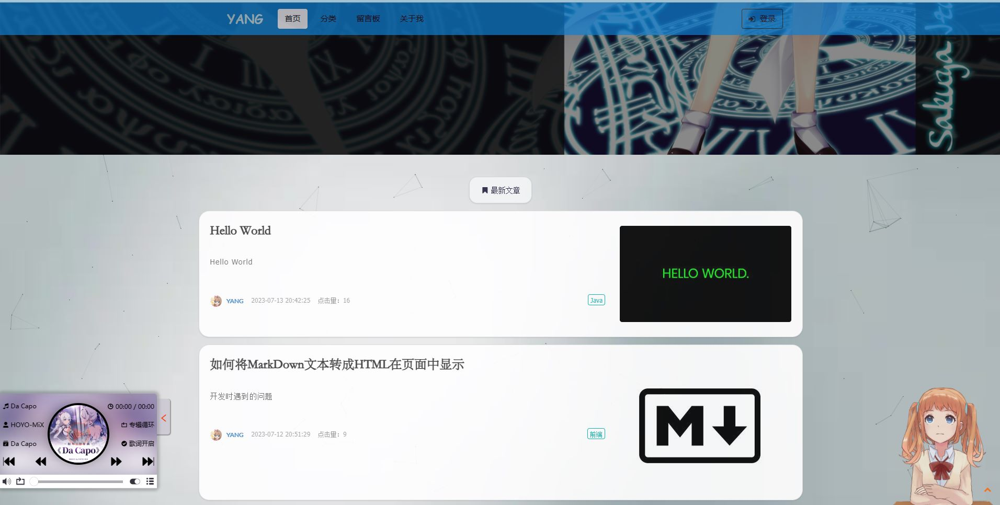
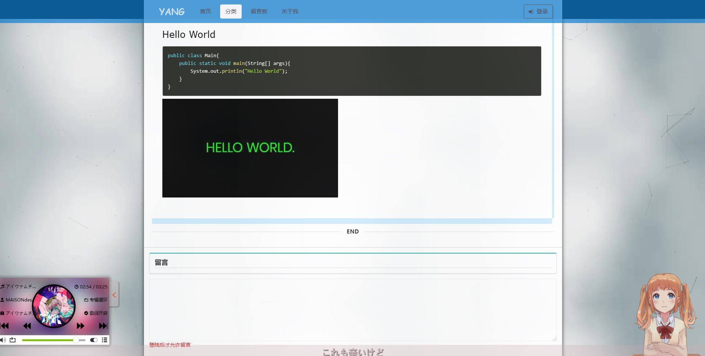
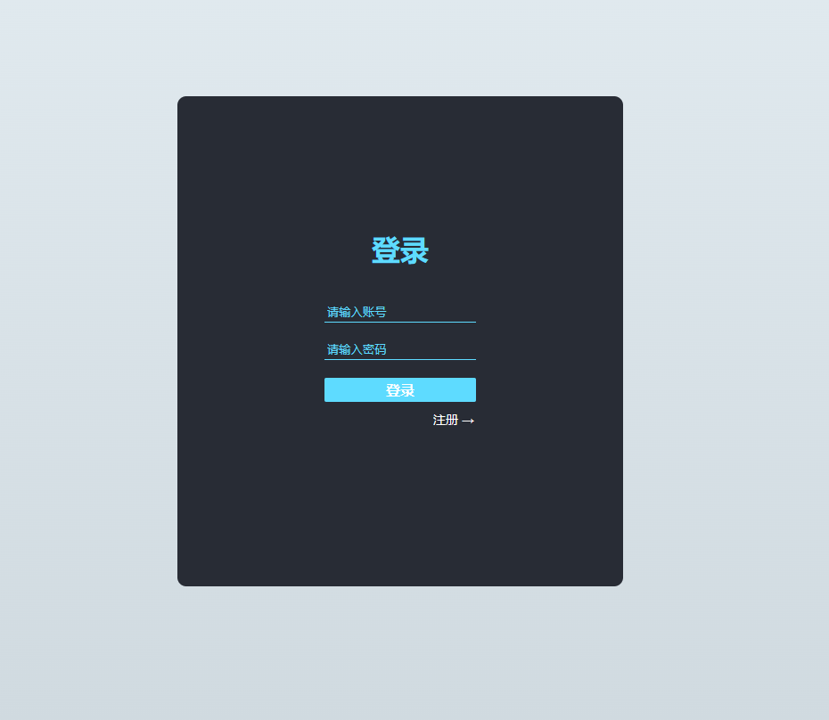
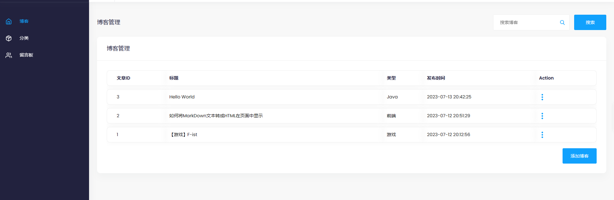
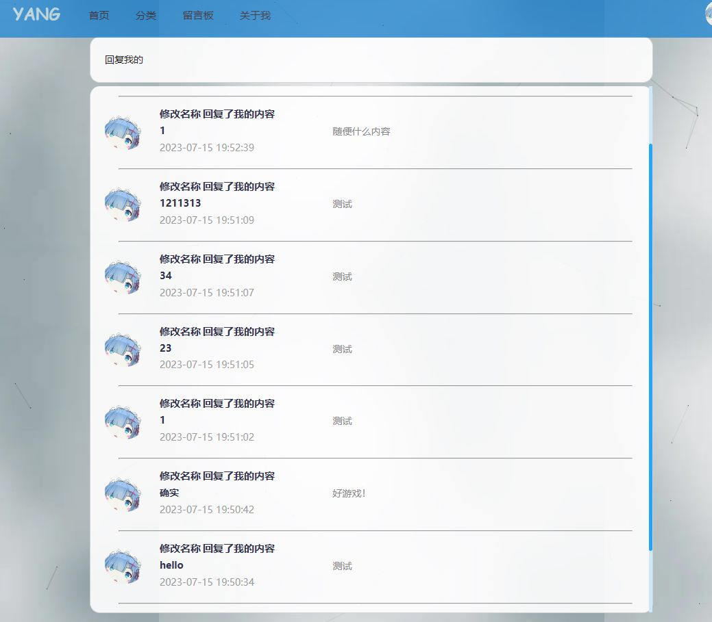
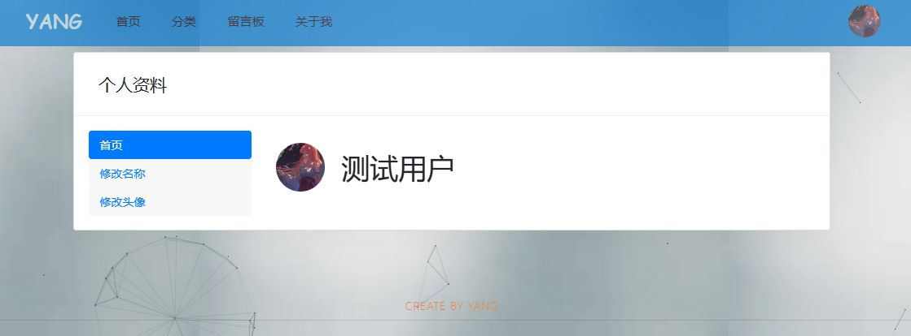

# 个人博客项目
## 作者:YANG
## 介绍:
#### 一个有SpringBoot+Thymeleaf 做的个人博客项目 前台+后台
#### 因为是第一个练手项目,所以代码上肯定纰漏百出,希望谅解

# 展示：

### 首页:

### 博客页面:

### 登录注册界面:

### 后台:

### 回复:

### 个人资料:

### 后续会添加的功能 `Todo` 列表

- [x] Web聊天室

---

## 技术点:
>* 框架：SpringBoot 3.1.1 + SpringSecurity 3.1.1
>* 持久层：Mybatis 3.5.13
>* 前端模板框架：Thymeleaf
>* 数据库：MySQL 8.0.32
## 功能介绍:
### 后台:
>* 支持博客发布
>* 分类的增删
>* 评论的删除
>* 密钥的生成
### 前台:
>* 主页展示
>* 博客查看
>* 博客内部评论
>* 留言板评论
>* 评论回复功能
>* 关于我
>* 个人资料的编辑
>* 查看所有回复功能
>* 登录与注册(注册使用密钥注册的方式)
>* 在每一个界面添加了一个live2D小人
>* 首页添加了明月浩空的音乐播放器 需要使用的话 还是推荐大家去注册一个 我会在前端的部分打上注解

--- 
### 因为本人前端技术实在差劲 许多信息交互全在后台完成的 请谅解

### 数据表文件放在了目录中:     blog.sql

#### 后台前端模板来源于网络

后台前端模板:https://sc.chinaz.com/
